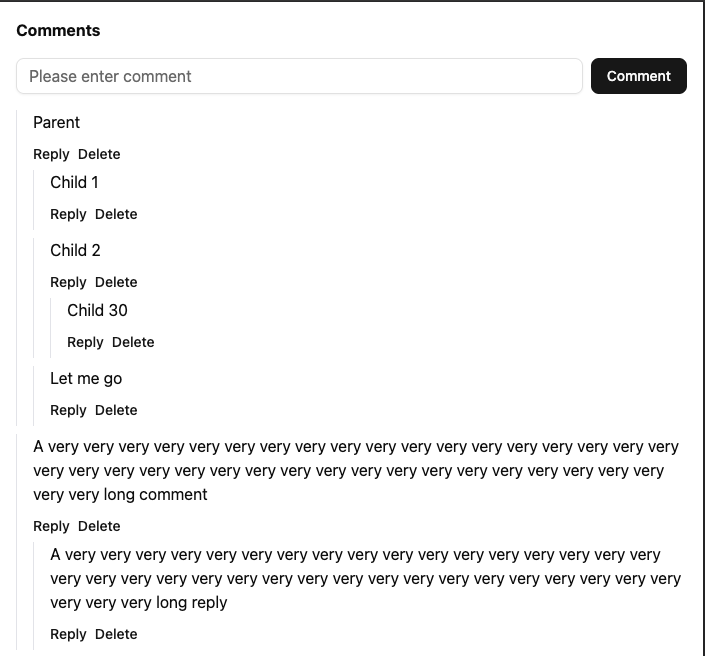

# f9Ec6cJe
This project implements a React component where users can add and remove text-based comments.

## Screenshot


# Features
- Display a list of comments.
- Add comments.
- Reply to existing comments.
- Delete comments.
- Local persistence with IndexedDB.
- Cross-tab updates without page refresh.

# Tech Stack
- TypeScript
- React
- Vite
- TailwindCSS
- shadcn/ui: Uses the `Button` and `Input` components only
- Dexie.js: A minimalistic wrapper for IndexedDB
- Vitest + React Testing Library for tests

# Design Patterns and Notable Decisions
- I chose Dexie for its ease of use, built-in transactions, and `liveQuery` for reactive updates across tabs. Regarding cross tab updates, an alternative could have been `BroadcastChannel` API.
- Singleton DB Instance: Ensures only one AppDB instance exists across the app.
- Dexie Entity Mapping: `Comment` class extends Dexie `Entity` to include methods like `reply()` and `delete()`.
- Atomic Recursive Delete: Deletes a comment and all nested replies in a single transaction.
- A `Comment` is represented by the TypeScript interface below. Notable are the `id` and `parentId` fields. This allows us to represent nested comments as a tree. In the code, the top-level comments have a `parentId` of `-1`: 
```typescript
interface Comment {
	id: number
	text: string
	parentId: number | null
	createdAt: Date

	delete: () => Promise<void>
	reply: (text: string) => Promise<Comment | undefined>
}
```

# Overview of Project Structure
```
├── src
│   ├── App.tsx                 # Main app to be tested
│   ├── components
│   │   ├── CommentItem.tsx     # Single comment component
│   │   ├── CommentList.tsx     # List of comments and replies
│   │   ├── Comments.tsx        # Main comments container
│   │   └── ui                  # shadcn/ui components
│   │       ├── button.tsx
│   │       └── input.tsx
│   ├── db
│   │   ├── AppDB.ts            # Dexie DB setup
│   │   ├── Comment.ts          # Comment entity with methods
│   │   └── db.ts               # Singleton DB instance
│   ├── index.css
│   ├── main.tsx
│   ├── setupTests.ts           # Test setup
│   └── types.ts
├── tests
│   ├── Comments.test.tsx       # Comments UI tests
│   └── db.test.ts              # Database tests
 ```

# Example Usage
```typescript
import Comments  from  "./components/Comments"

function  App() {
	return (
		<div className="p-4">
			<h1 className="font-bold mb-4">Comments</h1>
			<Comments />
		</div>
	)
}
export  default  App
```
 - Adding a root comment – Type text into the input at the top and click Comment.
 - Replying to a comment – Click Reply under a comment, type text, and click the reply button.
 - Deleting a comment – Click Delete. All nested replies are deleted atomically.

# Running the Project
```
git clone <repo-url>
npm install
npm run dev
```
Open the app in your browser at [http://localhost:5173/](http://localhost:5173/) and interact with the component.

# Running Tests
```
npm run test
```

## Tests cover:
- Creating root comments
- Adding replies to comments
- Recursive deletion
- Data persistence
- Comment text correctness

## Limitations and Future Improvements
- Error Handling: Currently, there is no error handling for database operations or user actions. In a production-ready version, I would:
	- Wrap async database calls in try/catch blocks.
	- Show user-friendly error messages.
	- Handle failures in transactions gracefully to avoid partial updates.
- Delete Confirmation: A confirmation popover before deletion could improve UX and prevent accidental data loss.
- Input Validation: While empty comments are ignored, further validation like max length, prohibited content, etc could be added.
- Performance Optimization: For extremely large comment trees, virtualization or pagination could be considered to maintain UI performance.
